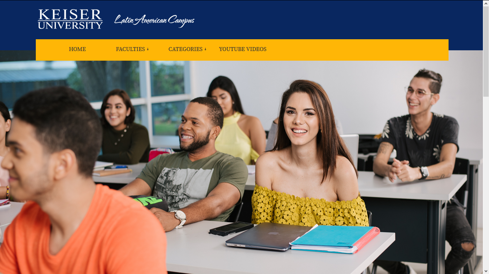
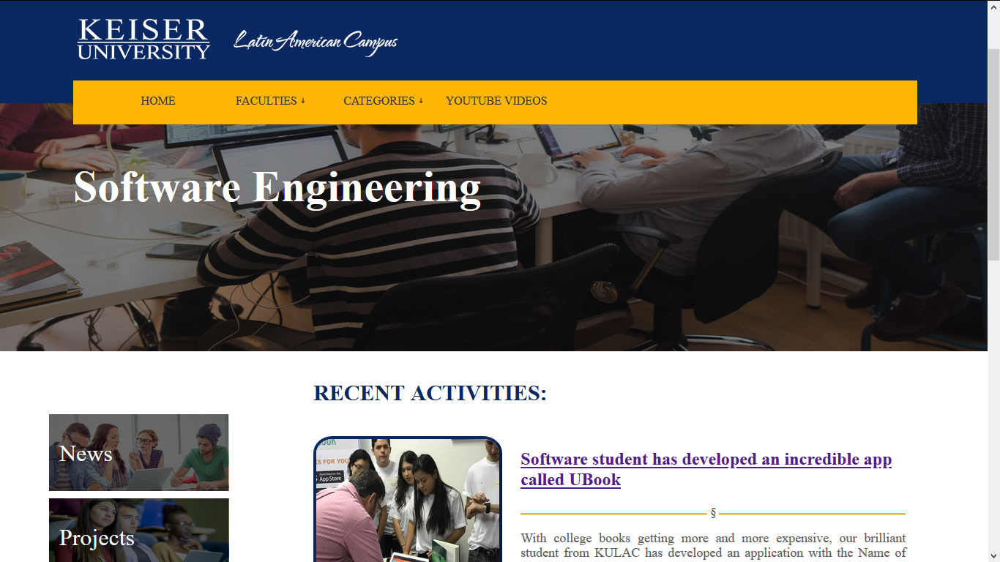
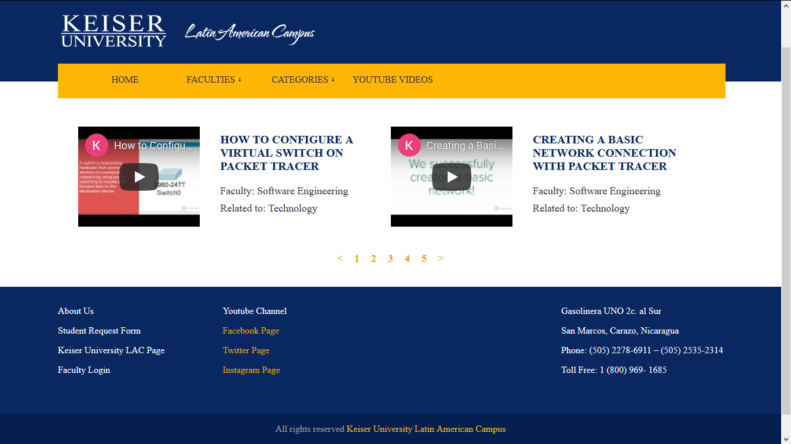
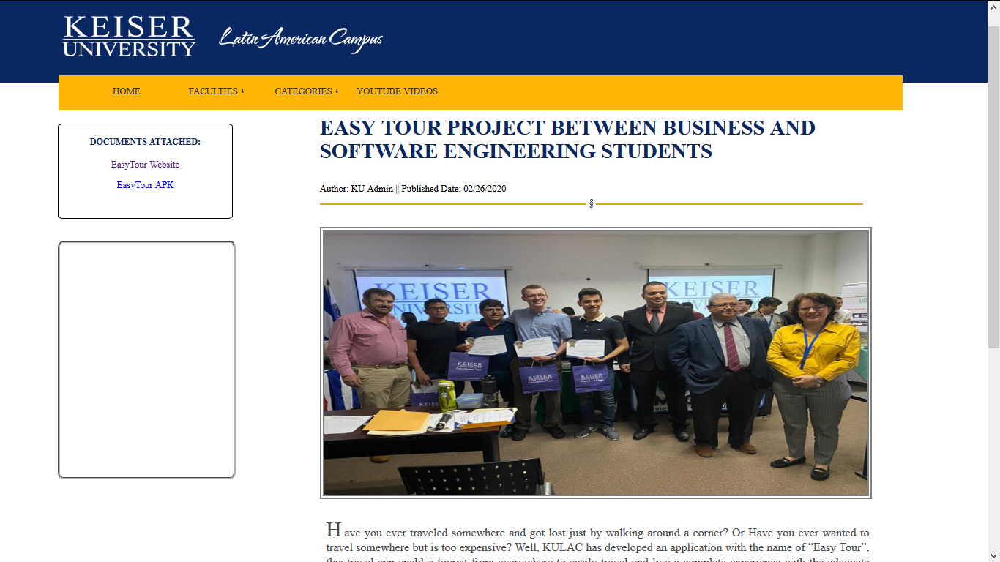

# KU Journal Page

This is fully educational repository. It contains a website project for Keiser University Latin American Campus.
You can  use the content, desing and scripts if you need it.  
This repository contains just the FE part. It <b>DOES NOT</b> contain any BE file or access to an admin pages. You can use some content with educational purpose but all the content is property of KU LAC. The objective is to give inspiration to create more projects like these to give a complete journal where <b>the student are the protagonist</b>.

# Languages & Tags used:
 
 1.PHP  
 2.HTML5  
 3.CSS3  
 4.Boootstrap  
 5.javascript  
 
 # Previews:
 <b>
Home Page
</b>  
 
  

<b>
 Faculty Example Page
  </b>

<b>
Youtube Videos Page
</b>   

<b>
Project Presentation Page
</b>   

  

# Notes:
* This project is still <b>in progress </b>and some features needs to be completed.   
* Some pages are not completely adaptatives (css needs some changes).
* Some pages may change in future uploads.
* You can re-use code but you must give credits to KU LAC.
  
